<h2>TensorFlow-FlexUNet-Image-Segmentation-Abdominal-US (2026/02/12)</h2>
Sarah T.  Arai 
Software Laboratory antillia.com  
This is the first experiment of Image Segmentation for <b>Abdominal-US (Abdominal Multi-Organ Ultrasound)</b> based on our <a href="./src/TensorFlowFlexUNet.py">TensorFlowFlexUNet</a> 
(TensorFlow Flexible UNet Image Segmentation Model for Multiclass), 
and 
<a href="https://drive.google.com/file/d/1v8EtWF7YHy9HZud6A9Nnr1G_aD7PoeHl/view?usp=sharing">
<b>Augmented-Abdominal-US-ImageMask-Dataset.zip</b></a> which was derived by us from   
<a href="https://www.kaggle.com/datasets/ignaciorlando/ussimandsegm">
<b>US simulation & segmentation</b> </a> on the kaggle.com.
  
<b>Data Augmentation Strategy</b> 
To address the limited size of images and masks of the original <b>Abdominal-US </b> dataset,
we used our offline augmentation tool <a href="./generator/ImageMaskDatasetGenerator.py">ImageMaskDatasetGenerator.py</a> (please see also: 
<a href="https://github.com/sarah-antillia/Image-Deformation-Tool">Image-Deformation-Tool</a>)
 to generate our Augmented Abdominal-US dataset.
   

<b>Actual Image Segmentation for Abdominal-US Images of  449x464 pixels </b> 
As shown below, the inferred masks predicted by our segmentation model trained by the dataset appear similar to the ground truth masks.
 
<a href="#color-class-mapping-table">Color class mapping table</a>
  
<table>
<tr>
<th>Input: image</th>
<th>Mask (ground_truth)</th>
<th>Prediction: inferred_mask</th>
</tr>
<tr>
<td>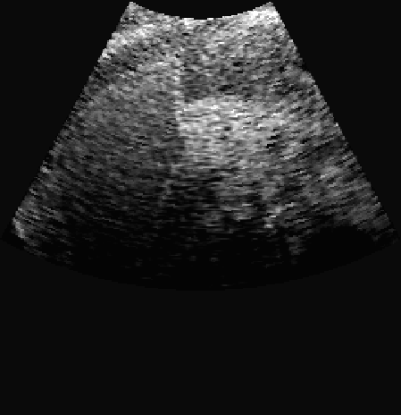</td>
<td></td>
<td>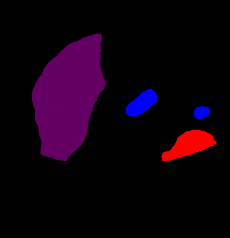</td>
</tr>

<tr>
<td>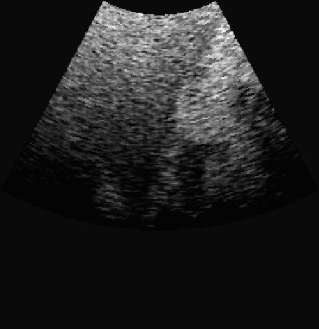</td>
<td></td>
<td>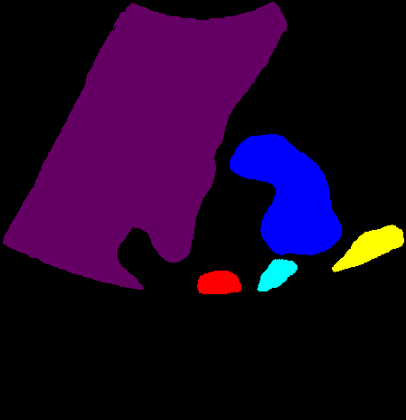</td>
</tr>

<tr>
<td>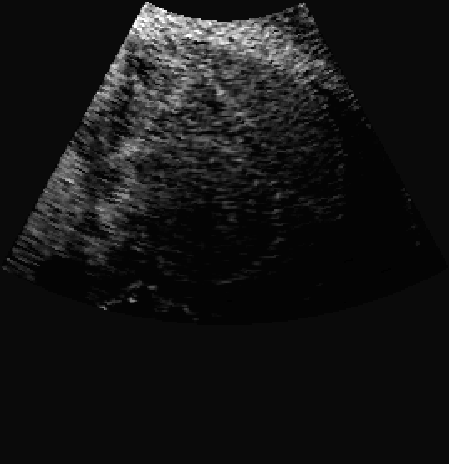</td>
<td>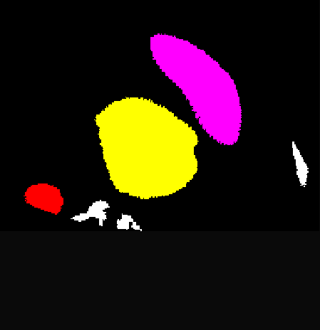</td>
<td>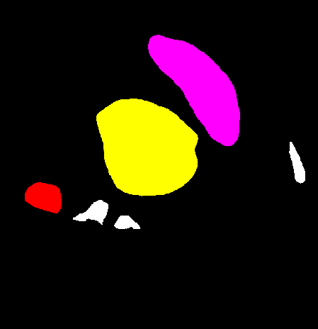</td>
</tr>
</table>

 
<h3>1  Dataset Citation</h3>
The dataset used here was derived from   
<a href="https://www.kaggle.com/datasets/ignaciorlando/ussimandsegm">
<b>US simulation & segmentation</b> </a>  
<b>Real and synthetic abdominal ultrasound scans, with manual segmentations</b> 
on the kaggle.com.
  
The following explanation was taken from above kaggle web site.
  
<b>About Dataset</b> 
<b>Context</b> 
Ultrasound (US) imaging allows a fast, cost-effective and non-invasive way to quickly assess inner areas of the body. 
This modality is therefore widely applied in emergentology, where it is used e.g. to identify potential bleedings or other traumatic injuries. 
Accurate interpretations, however, required particularly trained readers that must discriminate between variable echogenicity properties 
and speckle noise characteristics of the tissues. 
Moreover, the quality of the interpretation is also linked with the ability of the radiologists to localize anatomical areas using the US transducer.
 Consequently, a significant effort is being made to develop tools to train the readers both in US image acquisition and interpretation. 
 In this sense, US simulation offers a promising tool as it allows to recreate artificial scenarios with different abnormalities without 
 needing volunteers with pathologies. Furthermore, specific training exercises can be introduced to learn how to 
 manipulate the transducer without using a real device.
  
Generating realistic scans is a cornerstone to ensure a smooth transition of human trainees from US simulations to real US acquisitions, 
specially for image interpretation. However, current approaches still struggle to produce truthful artificial scans. 
In particular, US simulators based on ray-casting techniques have demonstrated to be efficient in terms of computational 
cost but fails in modeling some anatomical features as muscle fibers, fat streaks and microcalcifications or even imaging 
artifacts such as shadows and reverberations, comet tail artifacts, etc. In (Vitale et al., 2019) we introduced a CycleGAN based 
approach to improve realism in patient-specific abdominal US simulations obtained using ray-tracing algorithms.  
Although the method showed to outperform the baseline technique in a user based study, an in-depth analysis allowed us to observe 
that the generative model eventually introduces artifacts inconsistent with the anatomy of the patient. 
This is a typical problem of cycle-consistency based GANs, as stated in several papers. 
To overcome this limitation, several approaches have been recently proposed in the field of computer vision. In particular, 
the so-called ContrastGANs (Liang et al. 2017) alleviate this issue by using object-mask annotations provided in the training 
sets to guide the generation. However, collecting these segmentations is extremely hard when working with US images,
 as the tissues interfaces are usually difficult to discriminate and identifying the abdominal organs is challenging by itself.
  
<b>Content</b> 
The real US scans were acquired from 11 subjects without any abdominal pathology or known disease (40 % were female and 60 % 
were male, with age=27±3years). 
The procedure was a routine abdominal ultrasound session, following the corresponding acquisition 
protocol (9 hours of fasting before taking the examination). 
Some scans that make up the data set are: Left and right intercostal scan, left and right subcostal margin scan, longitudinal scan, 
transverse scan, FAST- Right upper quadrant, FAST- Left upper quadrant and FAST- Heart. To obtain the images we used a 
SonoSite M Turbo V 1.3 ultrasound device. This data set comprises 617 real US scans. Manual annotations of several abdominal 
organs are being performed, including liver, kidneys, gallbladder, spleen and vessels on a subset of 61 real US scans.
 
 
The simulated US scans were generated from our ray-casting based simulator (Rubi et al.,2017) using source images from the VISCERAL 
Anatomy3 challenge (Jimenez et al.2016). Since the original volumes comprise the entire body, 13 CT scans were manually 
cropped to focus only in the abdominal cavity (from the thoracic diaphragm to the pelvic inlet) and were adapted to used in the simulator. 
In addition, the simulator requires a scattering volume that was retrieved per each individual CT scan using the efficient approach 
presented in (D'Amato et al., 2015). As a result, this data set comprises 926 artificially US scans.  
Annotations of each scan was generated using silver standard annotations of several abdominal organs (including liver, pancreas, 
adrenals, gallbladder, spleen, liver, vessels and bones) included in the CT dataset.  
<b>Credit</b> 
Vitale, S., Orlando, J. I., Iarussi, E., & Larrabide, I. (2019). Improving realism in patient-specific abdominal ultrasound simulation using CycleGANs.  
International Journal of Computer Assisted Radiology and Surgery, 15(2), 183-192.
  
<b>License</b> 
Data files © Original Authors
 
 
<h3>
2 Abdominal-US ImageMask Dataset
</h3>
 If you would like to train this Abdominal-US Segmentation model by yourself,
please down load our dataset <a href="https://drive.google.com/file/d/1v8EtWF7YHy9HZud6A9Nnr1G_aD7PoeHl/view?usp=sharing">
<b>Augmented-Abdominal-US-ImageMask-Dataset.zip</b>
</a> on the google drive, expand the downloaded, and put it under <b>./dataset/</b> to be.
<pre>
./dataset
└─Abdominal-US
    ├─test
    │   ├─images
    │   └─masks
    ├─train
    │   ├─images
    │   └─masks
    └─valid
        ├─images
        └─masks
</pre>
We used the following color-class mapping table to define a rgb_map mask format between indexed colors and rgb colors. 
 
<a id="color-class-mapping-table"><b>Abdominal-US color class mapping table</b></a><table border=1 style='border-collapse:collapse;' cellpadding='5'>
<tr><th>Indexed Color</th><th>Color</th><th>RGB</th><th>Class</th></tr>
<tr><td>1</td><td with='80' height='auto'></td><td>(100, 0, 100)</td><td>liver</td></tr>
<tr><td>2</td><td with='80' height='auto'></td><td>(255, 255, 255)</td><td>bone</td></tr>
<tr><td>3</td><td with='80' height='auto'></td><td>(0, 255, 0)</td><td>gallbladder</td></tr>
<tr><td>4</td><td with='80' height='auto'></td><td>(255, 255, 0)</td><td>kidney</td></tr>
<tr><td>5</td><td with='80' height='auto'></td><td>(0, 0, 255)</td><td>pancreas</td></tr>
<tr><td>6</td><td with='80' height='auto'></td><td>(255, 0, 0)</td><td>vessels</td></tr>
<tr><td>7</td><td with='80' height='auto'></td><td>(255, 0, 255)</td><td>spleen</td></tr>
<tr><td>8</td><td with='80' height='auto'></td><td>(0, 255, 255)</td><td>adrenal</td></tr>
</table>
 
 
<b>Abdominal-US Statistics</b> 
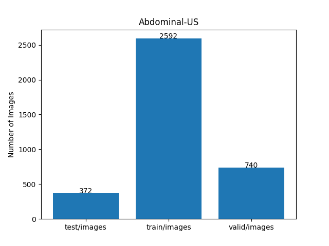 
 
As shown above, the number of images of train and valid datasets is large enough to use for a training set of our segmentation model.
  

<b>Train_images_sample</b> 
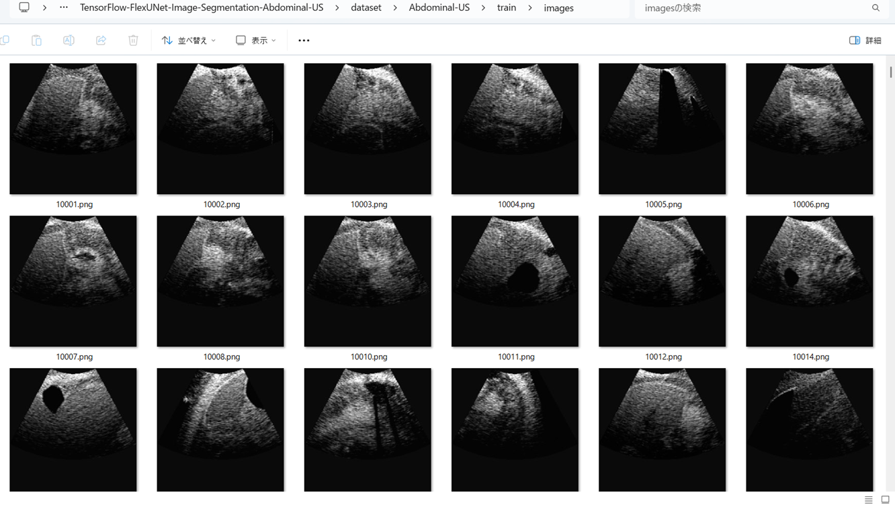
 
<b>Train_masks_sample</b> 
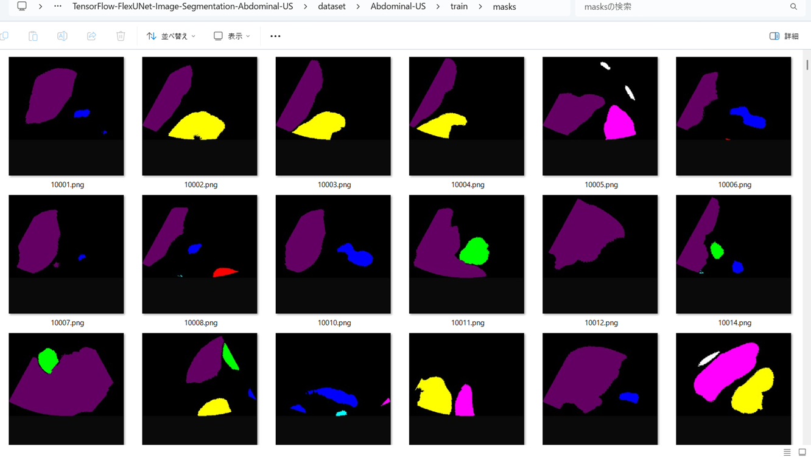
 
<h3>
3 Train TensorflowFlexUNet Model
</h3>
 We trained Abdominal-US TensorflowFlexUNet Model by using the following
<a href="./projects/TensorFlowFlexUNet/Abdominal-US/train_eval_infer.config"> <b>train_eval_infer.config</b></a> file.  
Please move to ./projects/TensorFlowFlexUNet/Abdominal-US, and run the following bat file. 
<pre>
>1.train.bat
</pre>
, which simply runs the following command. 
<pre>
>python ../../../src/TensorFlowFlexUNetTrainer.py ./train_eval_infer.config
</pre>

<b>Model parameters</b> 
Defined a small <b>base_filters=16</b> and a large <b>base_kernels=(11,11)</b> for the first Conv Layer of Encoder Block of 
<a href="./src/TensorFlowFlexUNet.py">TensorFlowFlexUNet.py</a> 
and a large num_layers (including a bridge between Encoder and Decoder Blocks).
<pre>
[model]
image_width    = 512
image_height   = 512
image_channels = 3
input_normalize = True
normalization  = False
num_classes    = 9
base_filters   = 16
base_kernels  = (11,11)
num_layers    = 8
dropout_rate   = 0.05
dilation       = (1,1)
</pre>
<b>Learning rate</b> 
Defined a small learning rate.  
<pre>
[model]
learning_rate  = 0.00007
</pre>
<b>Loss and metrics functions</b> 
Specified "categorical_crossentropy" and "dice_coef_multiclass". 
<pre>
[model]
loss           = "categorical_crossentropy"
metrics        = ["dice_coef_multiclass"]
</pre>
<b >Learning rate reducer callback</b> 
Enabled learing_rate_reducer callback, and a small reducer_patience.
<pre> 
[train]
learning_rate_reducer = True
reducer_factor     = 0.5
reducer_patience   = 4
</pre>
<b>Early stopping callback</b> 
Enabled early stopping callback with patience parameter.
<pre>
[train]
patience      = 10
</pre>
<b></b> 
<b>RGB color map</b> 
rgb color map dict for Abdominal-US 1+8 classes. 
<pre>
[mask]
mask_file_format = ".png"
;Abdominal-US 1+8
rgb_map = {(0,0,0):0, (100,0,100):1, (255,255,255):2, (0,255,0):3, (255,255,0):4, (0,0,255):5, (255,0,0):6, (255,0,255):7, (0,255,255):8}
</pre>
<b>Epoch change inference callbacks</b> 
Enabled epoch_change_infer callback. 
<pre>
[train]
epoch_change_infer       = True
epoch_change_infer_dir   =  "./epoch_change_infer"
epoch_changeinfer        = False
epoch_changeinfer_dir    = "./epoch_changeinfer"
num_infer_images         = 6
</pre>
By using this epoch_change_infer callback, on every epoch_change, the inference procedure can be called
 for 6 images in <b>mini_test</b> folder. This will help you confirm how the predicted mask changes 
 at each epoch during your training process.    
<b>Epoch_change_inference output at starting (1,2,3)</b> 
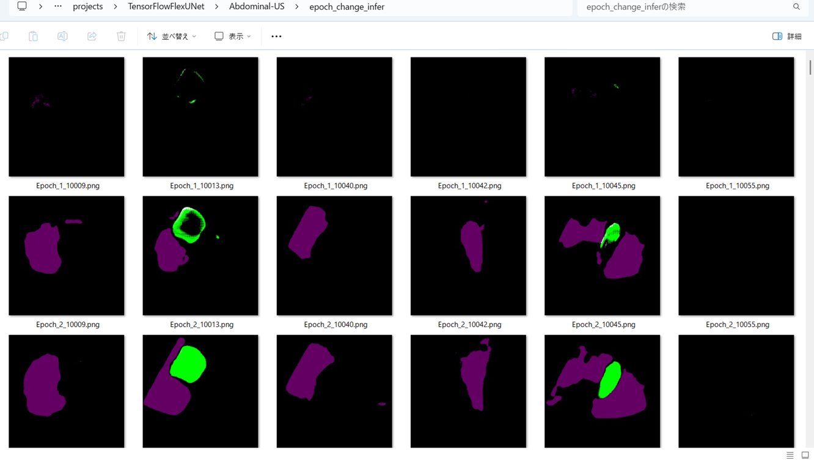 
 
<b>Epoch_change_inference output at middle-point (38,39,40)</b> 
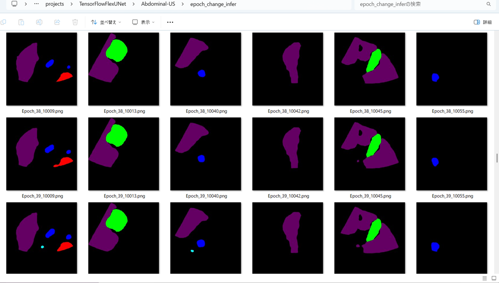 
 
<b>Epoch_change_inference output at ending (78,79,80)</b> 
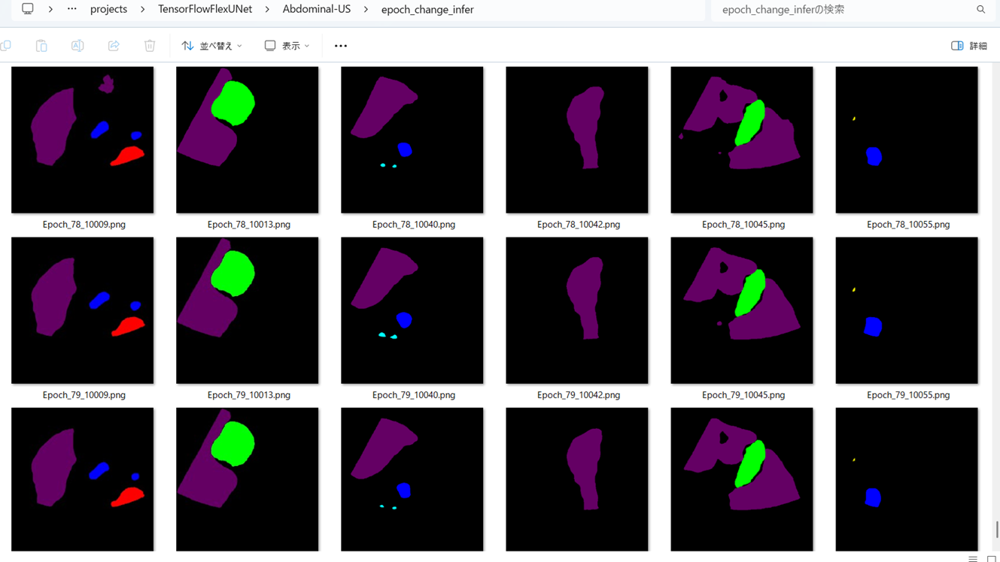 

 
In this experiment, the training process was terminated at epoch 80.  
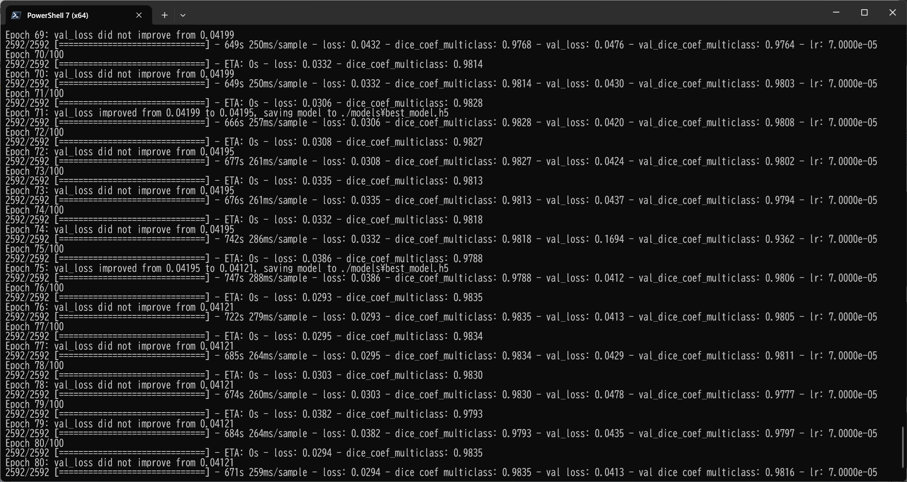 
 
<a href="./projects/TensorFlowFlexUNet/Abdominal-US/eval/train_metrics.csv">train_metrics.csv</a> 
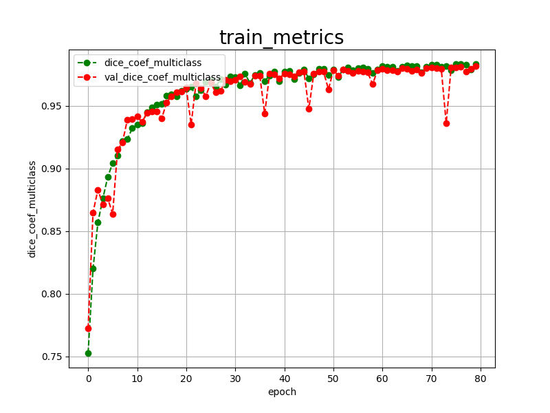 

 
<a href="./projects/TensorFlowFlexUNet/Abdominal-US/eval/train_losses.csv">train_losses.csv</a> 
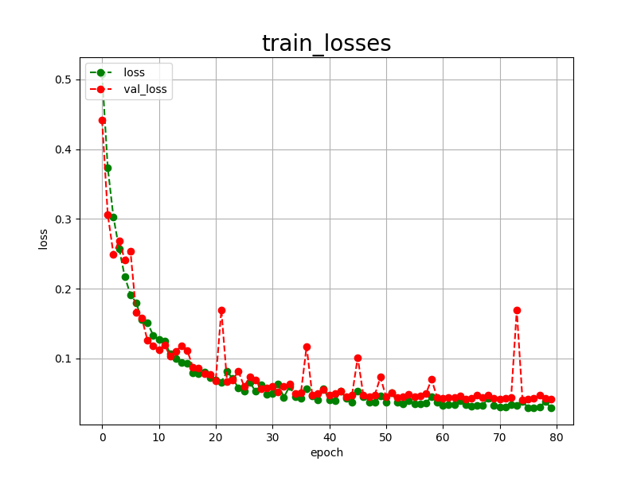 
 
<h3>
4 Evaluation
</h3>
Please move to a <b>./projects/TensorFlowFlexUNet/Abdominal-US</b> folder, and run the following bat file to evaluate TensorflowFlexUNet model for Abdominal-US. 
<pre>
>./2.evaluate.bat
</pre>
This bat file simply runs the following command.
<pre>
>python ../../../src/TensorFlowFlexUNetEvaluator.py  ./train_eval_infer.config
</pre>
Evaluation console output: 
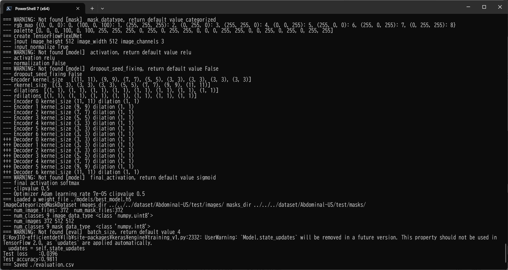
  Image-Segmentation-Abdominal-US

<a href="./projects/TensorFlowFlexUNet/Abdominal-US/evaluation.csv">evaluation.csv</a> 
The loss (categorical_crossentropy) to this Abdominal-US/test was not so low, but dice_coef_multiclass  high as shown below.
 
<pre>
categorical_crossentropy,0.0396
dice_coef_multiclass,0.9811
</pre>
 
<h3>5 Inference</h3>
Please move to a <b>./projects/TensorFlowFlexUNet/Abdominal-US</b> folder, and run the following bat file to infer segmentation regions for images by the Trained-TensorflowFlexUNet model for Abdominal-US. 
<pre>
>./3.infer.bat
</pre>
This simply runs the following command.
<pre>
>python ../../../src/TensorFlowFlexUNetInferencer.py ./train_eval_infer.config
</pre>

<b>mini_test_images</b> 
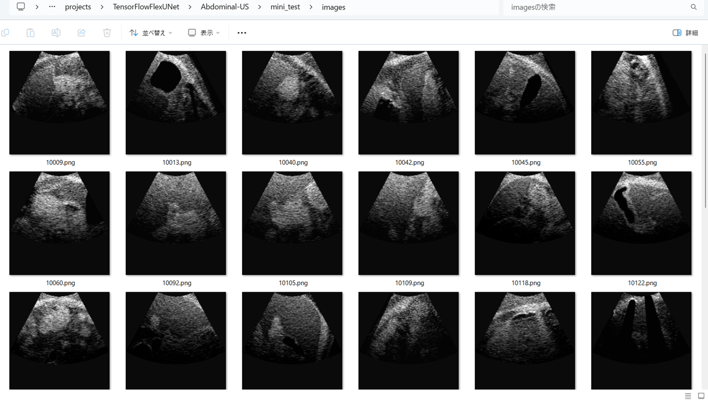 
<b>mini_test_mask(ground_truth)</b> 
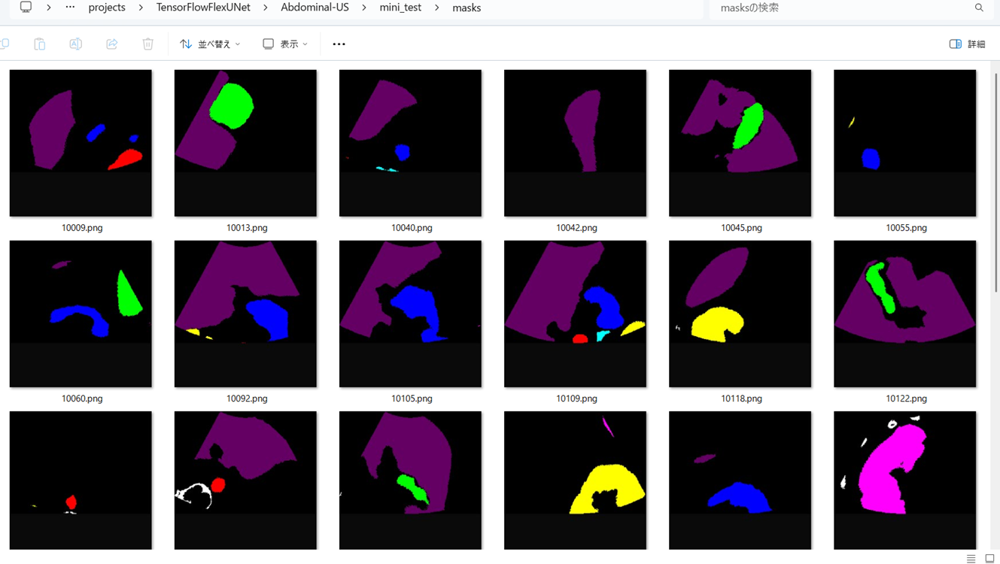 

<b>Inferred test masks</b> 
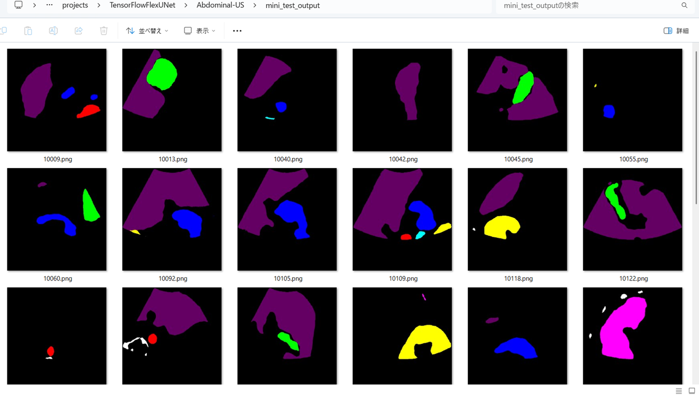 
 

<b>Enlarged images and masks for  Abdominal-US  Images of 449x464 pixels</b> 
As shown below, the inferred masks predicted by our segmentation model trained by the dataset appear similar to the ground truth masks.
 
<a href="#color-class-mapping-table">Color class mapping table</a>
 
 
<table>
<tr>
<th>Input: image</th>
<th>Mask (ground_truth)</th>
<th>Prediction: inferred_mask</th>
</tr>
<tr>
<td>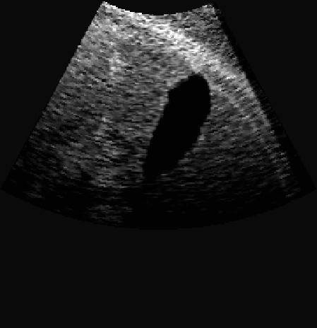</td>
<td>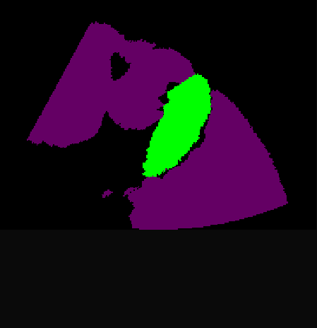</td>
<td></td>
</tr>

<tr>
<td></td>
<td></td>
<td></td>
</tr>

<tr>
<td>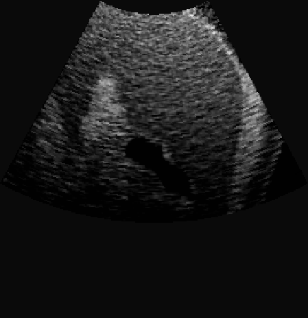</td>
<td>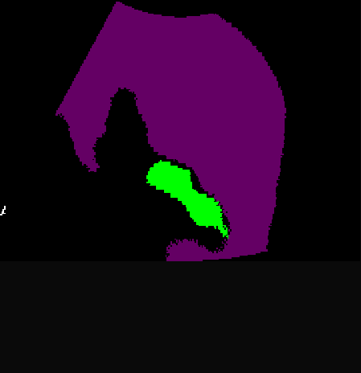</td>
<td>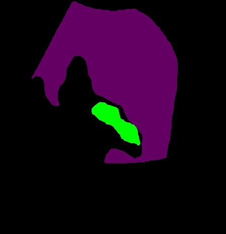</td>
</tr>
<tr>
<td>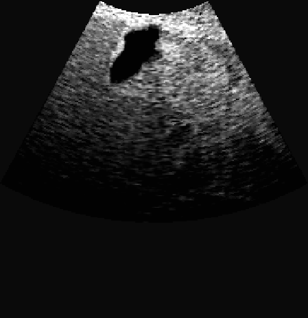</td>
<td></td>
<td>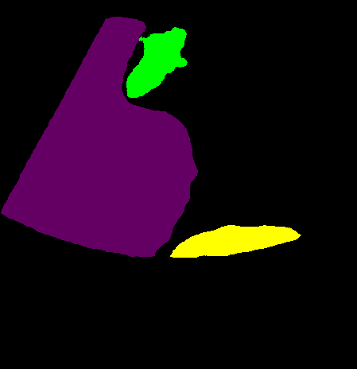</td>
</tr>
<tr>
<td>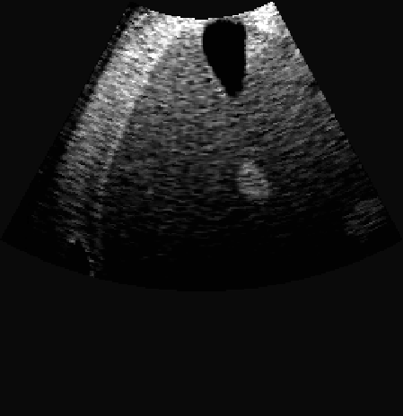</td>
<td>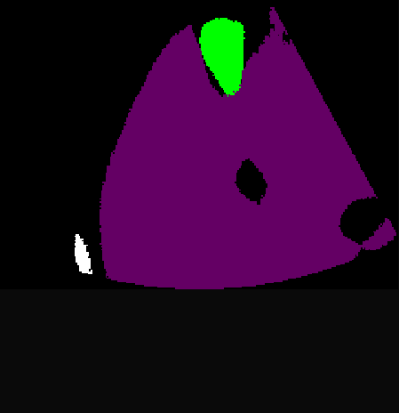</td>
<td>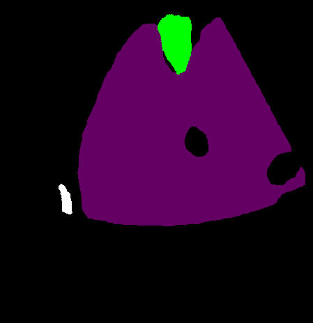</td>
</tr>
<tr>
<td></td>
<td></td>
<td></td>
</tr>
</table>

 
<h3>
References
</h3>
<b>1. Improving realism in abdominal ultrasound simulation combining a segmentation-guided  
loss and polar coordinates training</b> 
Santiago Vitale, José Ignacio Orlando, Emmanuel Iarussi, Alejandro Díaz, Ignacio Larrabide 
<a href="https://ignaciorlando.github.io/publication/2025-medphys/2025-medphys.pdf">
https://ignaciorlando.github.io/publication/2025-medphys/2025-medphys.pdf</a>
  
<b>2. TensorFlow-FlexUNet-Image-Segmentation-Model</b> 
Toshiyuki Arai  
<a href="https://github.com/sarah-antillia/TensorFlow-FlexUNet-Image-Segmentation-Model">
TensorFlow-FlexUNet-Image-Segmentation-Model
</a>
 
 
